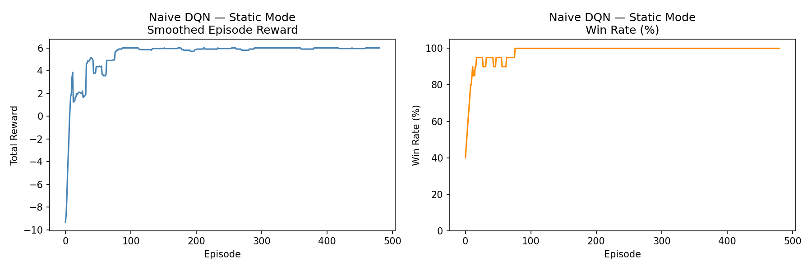
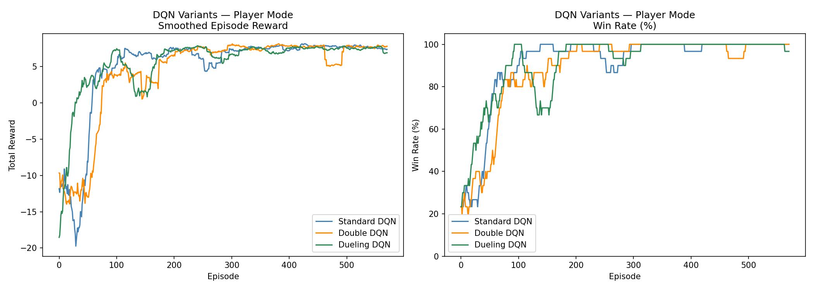
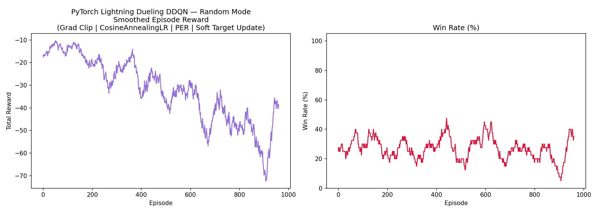

# 📘 Homework 3: DQN and its Variants

[](https://www.python.org/downloads/)
[](https://pytorch.org/)
[](https://www.pytorchlightning.ai/)

This project implements Deep Q-Networks (DQN) and its advanced variants (Double DQN, Dueling DQN) to solve a custom 3x4 GridWorld environment.

---

## 📺 Live Demo (Static Mode)

The following demonstrates the agent's pathfinding in the **Static Mode** after training.

```text
Initial grid:
- - - G 
- W - P 
+ - - - 

Action=up, reward=-1, done=False
- - - G 
+ W - P 
- - - - 

Action=up, reward=-1, done=False
+ - - G 
- W - P 
- - - - 

Action=right, reward=-1, done=False
- + - G 
- W - P 
- - - - 

Action=right, reward=-1, done=False
- - + G 
- W - P 
- - - - 

Action=right, reward=10, done=True
Goal reached!
```

---

## 🏗️ Project Structure

```
dqn_hw3/
├── environment.py          # Custom 3×4 GridWorld (static / player / random)
├── hw3_1_naive_dqn.py      # HW3-1: Naive DQN + Experience Replay (static)
├── hw3_1_report.md         # HW3-1: Understanding report
├── hw3_2_enhanced_dqn.py   # HW3-2: Double DQN & Dueling DQN (player)
├── hw3_3_lightning_dqn.py  # HW3-3: PyTorch Lightning DQN + tips (random)
├── live_demo.py            # Local visualization script
└── README.md               # This file
```

---

## 🌍 Environment Modes

A 3 × 4 GridWorld with three distinct modes:

| Mode | Player Position | Goal/Pit/Wall Position | Use Case |
|---|---|---|---|
| `static` | Fixed (2,0) | Fixed | Test correctness / reproducibility |
| `player` | Random | Fixed | Test strategy with varying starts |
| `random` | Random | Random | Train a stronger, generalised policy |

**Encoding:** state vector of length 12 (3×4 flattened):
- `-1.0` = Wall | `-0.5` = Pit | `+0.5` = Goal | `+1.0` = Player | `0.0` = Empty

---

## 🧠 HW3-1: Naive DQN (Static Mode)

Basic DQN implementation with an **Experience Replay Buffer** to stabilize training by breaking temporal correlations.

### Training Progress


> **Key concepts:** ε-greedy exploration, TD-learning, Replay Memory.
> See [hw3_1_report.md](hw3_1_report.md) for the full analysis.

---

## ⚖️ HW3-2: Enhanced DQN Variants (Player Mode)

Comparison of advanced architectures on the **Player Mode** (random starting positions).

### Comparative Results


| Variant | Improvement |
|---|---|
| **Standard DQN** | Baseline performance. |
| **Double DQN** | Decouples action selection from evaluation to reduce Q-value overestimation. |
| **Dueling DQN** | Separates state value $V(s)$ and action advantage $A(s,a)$ for better generalization. |

---

## 🔁 HW3-3: Lightning DQN + Training Tips (Random Mode)

Fully randomized environment solved using **PyTorch Lightning** with industrial-grade training stabilizers.

### Training Stability


| Technique | Benefit |
|---|---|
| **Gradient Clipping** | Prevents gradient explosion in complex random layouts. |
| **Cosine Annealing LR** | Smoothly decays learning rate for better convergence. |
| **PER (Prioritized Replay)** | Samples "surprising" transitions (high TD-error) more frequently. |
| **Soft Target Update** | Uses Polyak averaging ($\tau=0.005$) for smoother target tracking. |

---

## 🚀 How to Run

### 1. Install Dependencies
```bash
pip install torch lightning matplotlib numpy
```

### 2. Execute Training
```bash
# Task 1
python hw3_1_naive_dqn.py

# Task 2
python hw3_2_enhanced_dqn.py

# Task 3
python hw3_3_lightning_dqn.py
```

---

## 📚 References

- [Deep Reinforcement Learning in Action](https://github.com/DeepReinforcementLearning/DeepReinforcementLearningInAction)
- Mnih et al. (2013) - DQN Original Paper
- Wang et al. (2016) - Dueling DQN
- Van Hasselt et al. (2016) - Double DQN
