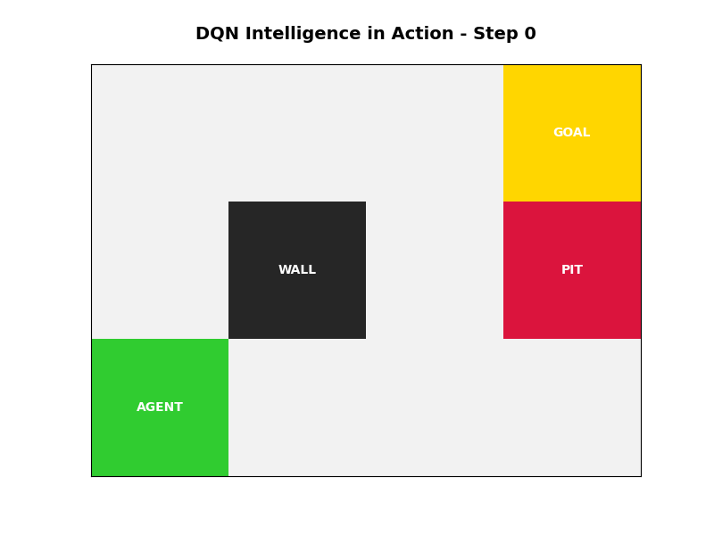

# 🤖 Deep Q-Network & Variants Showcase

<p align="center">
  
</p>

<p align="center">
  <b>A comprehensive implementation of Deep Reinforcement Learning (DRL) algorithms applied to a dynamic GridWorld environment.</b>
</p>

---

## 🌟 Overview

This repository contains a high-performance, modular implementation of **DQN (Deep Q-Network)** and its most influential variants. Built using **PyTorch** and **PyTorch Lightning**, this project explores the transition from naive value-based methods to state-of-the-art stabilization techniques.

### 🚀 Key Features
- **Naive DQN**: Foundation with Experience Replay.
- **Double DQN**: Correction for Q-value overestimation bias.
- **Dueling DQN**: Specialized architecture for state-value and action-advantage decoupling.
- **Lightning Framework**: Production-ready training loop using PyTorch Lightning.
- **Stabilization Suite**:
  - ⚡ **Prioritized Experience Replay (PER)**
  - 🛠️ **Gradient Clipping**
  - 📉 **Cosine Annealing LR Scheduler**
  - 🔄 **Polyak Soft Target Updates**

---

## 🛠️ Technical Specifications

### 1. Agent Architecture
| Component | Specification |
| :--- | :--- |
| **Network Type** | Multi-Layer Perceptron (MLP) |
| **Hidden Layers** | 2 Layers (128 units each) |
| **Activation** | ReLU (Rectified Linear Unit) |
| **Output Layer** | Linear (Action size = 4) |
| **Dueling Split** | Separate V(s) [1 unit] and A(s,a) [4 units] heads |

### 2. Hyperparameters
| Parameter | Value | Description |
| :--- | :--- | :--- |
| `Learning Rate` | 3e-4 | Initial rate with Cosine Annealing |
| `Discount (γ)` | 0.99 | Emphasis on future rewards |
| `Batch Size` | 128 | Size of random sample from buffer |
| `Buffer Size` | 20,000 | Total transitions stored |
| `Epsilon Decay` | 0.997 | Rate of transition from exploration to exploitation |
| `Tau (τ)` | 0.005 | Target network update smoothing factor |

### 3. Environment: 3x4 GridWorld
- **State Space**: Discrete $12$-dimensional vector (flattened 3x4 grid).
- **Action Space**: Discrete $4$ (Up, Down, Left, Right).
- **Reward Function**:
  - Goal reached: $+10$
  - Pitfall: $-10$
  - Per-step penalty: $-1$ (optimal path incentive)

---

## 📈 Performance Results

### HW3-1: Base Stability
The naive DQN demonstrates consistent convergence in fixed environments through the use of an **Experience Replay Buffer**.

 

### HW3-3: Generalized Intelligence
Utilizing **Prioritized Experience Replay** and **Gradient Clipping**, the Lightning-based model achieves stable learning even in fully randomized environments.

<p align="center">
  
</p>

---

## 💻 Installation & Usage

### Prerequisites
- Python 3.13+
- PyTorch / Lightning
- Matplotlib / Numpy

```bash
# Clone the repository
git clone https://github.com/Jester-99/DQN-and-its-variants.git
cd DQN-and-its-variants

# Install requirements
pip install torch lightning matplotlib numpy
```

### Running the Demo
Execute the live visualization of the trained agent:
```bash
python live_demo.py
```

---

## 📑 Detailed Documentation
For a deep dive into the mathematical formulations and implementation logic, please refer to:
- [📖 Tutorial: Purpose, Method, and Results](TUTORIAL.md)
- [📝 HW3-1 Understanding Report](hw3_1_report.md)

---
<p align="center">
  Developed by <a href="https://github.com/Jester-99">Jester-99</a>
</p>
